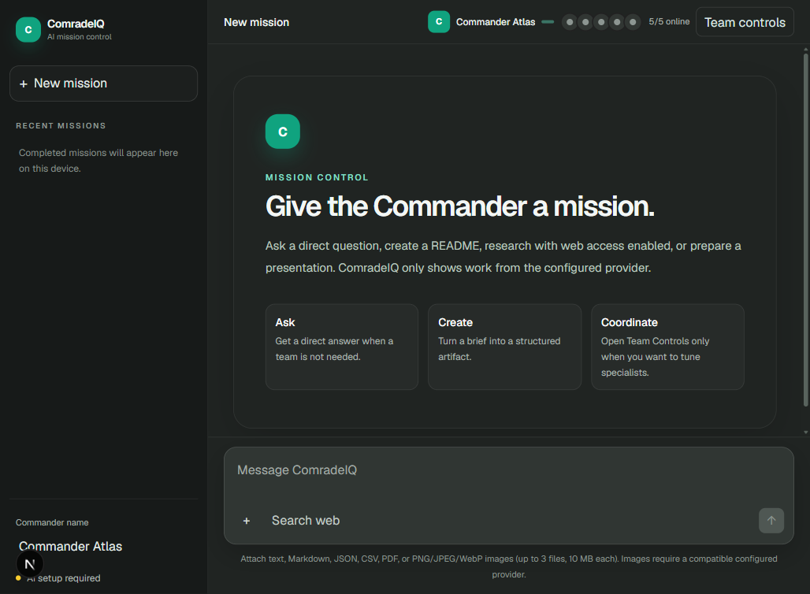
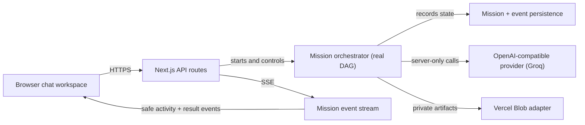

<div align="center">

# ComradeIQ

### One prompt. A whole AI team. A finished, verified deliverable.

**ComradeIQ is an AI mission control.** You give Commander Atlas an objective, and a coordinated team of specialists (Researcher, Writer, Critic, Formatter, Assembler) works through a real dependency pipeline to hand you back a downloadable result, while you watch every step happen live.

[](https://nextjs.org/)
[](https://react.dev/)
[](https://www.typescriptlang.org/)
[](https://groq.com/)
[](LICENSE)

**[Live app](https://comradeiq.vercel.app)** · [Landing page](https://comradeiq.vercel.app) · [Devpost story](DEVPOST.md)



</div>

---

## Why ComradeIQ

Most "multi-agent" AI demos are theater: spinning cards that invent their own progress, phantom parallel calls, and confident answers with no traceable source. ComradeIQ takes the opposite stance. Every visible update traces to a real event, every artifact to real storage, and every error is an honest error. When a capability is not configured, the product says so plainly instead of faking it.

## What it does

Give one objective and ComradeIQ routes it to the right workflow automatically:

| Mode | You get |
| --- | --- |
| **Direct chat** | A fast, single answer with no unnecessary overhead |
| **Document** | A downloadable **Markdown** file (README, spec, report, docs) |
| **Presentation** | A downloadable **PPTX** deck in one of 4 themes (Camo, Cyberpunk, Minimal, Ocean) |
| **Research** | A **sourced, cited** answer with real links (opt-in web access) |

For work that needs coordination, the Commander builds and executes a real **dependency DAG**:

```
Researcher --> Writer --> Formatter --> Critic --> Assembler --> Commander QA
```

Each specialist waits for its actual upstream output, and each role sees only its own inputs (no shared transcript).

## Signature features

- **Live agent graph.** A dependency-DAG visualization where every specialist node lights up in real time (thinking, working, done) and edges pulse as work flows downstream.
- **Live agent console.** A terminal-style ops log streaming the real orchestration events (`dispatch --agent writer`, `[critic] working`, `mission complete`). Each line expands to reveal that agent's actual contribution.
- **Full five-agent pipeline.** Document and slide missions run the whole team, visible end to end.
- **Play chess with the Commander.** Say "play chess with me" and a rules-validated board opens in chat. You play White; Commander Atlas plays Black through the same model that runs missions.
- **In-chat video.** Ask for "a video of how jet engines work" and ComradeIQ searches YouTube and embeds a playable player inline.
- **Shareable permalinks.** Completed missions get a read-only `/m/<id>` link anyone can open, no account required.
- **Chat management.** A hover menu on every conversation to share, archive, or delete it.
- **One-click demo.** A "Watch live demo" button auto-runs a representative mission so a first-time visitor sees the full pipeline in seconds.

## How it works

The browser only ever receives owner-scoped mission and artifact URLs. Provider credentials, storage, validation, orchestration, and durable event persistence all stay on the server.



See the [detailed architecture](docs/architecture.md) for the full breakdown.

## Tech stack

- **Next.js 15, React 19, TypeScript, Tailwind CSS** for a responsive, type-safe chat workspace
- **Any OpenAI-compatible provider** for server-only model calls; the live deployment runs **Groq `llama-3.3-70b`**
- **Server-Sent Events** for live progress, with optional Ably as a progressive enhancement
- **Vercel Blob** private storage for durable mission records and artifact bytes
- **PptxGenJS** for server-side decks, **chess.js** for a legality-validated board with an LLM opponent, and a keyless **YouTube search + embed** for in-chat video
- **Zustand** for client state, **Vitest + Playwright** for unit, DAG, state, accessibility, and reconnect coverage

## Routes

| Route | Purpose |
| --- | --- |
| `/` | Marketing landing page (shown first) |
| `/app` | The ComradeIQ mission-control tool |
| `/m/[missionId]` | Public, read-only shared mission result |

## Quick start

**Prerequisites:** Node.js 22.13+ and npm, plus an API key for any OpenAI-compatible provider (a Groq `gsk_...` key works out of the box).

```bash
git clone https://github.com/ShivankXD/ComradeIQ.git
cd ComradeIQ
npm ci
cp .env.example .env.local   # then add your key
npm run dev
```

Open [http://localhost:3000](http://localhost:3000). Without a key, ComradeIQ shows an honest setup state instead of faking a response.

### Minimal configuration

A single key is enough to run live. A `gsk_...` key is auto-detected and configured for Groq:

```env
OPENAI_API_KEY=gsk_your_key_here
```

Full options are documented in [`.env.example`](.env.example). Deployment guidance (including the Vercel Blob store that makes replies and downloads durable across serverless instances) is in [VERCEL_SETUP.md](VERCEL_SETUP.md).

## Project structure

```
app/            Landing page, /app tool, /m share page, API routes
components/     Chat workspace, agent graph, agent console, chess, video, panels
lib/            Orchestrator, DAG, provider client, intent routing, storage, store
docs/           Architecture, testing, screenshots
tests/          Vitest unit + Playwright e2e
```

## Verify and build

```bash
npm run lint
npm run test
npm run build
```

Browser coverage:

```bash
npx playwright install chromium
npm run test:e2e
```

## Privacy and security

- Provider, Ably, and Blob credentials are server-only and never exposed to the browser.
- An HTTP-only anonymous session cookie owns missions, events, retries, cancellation, and artifacts.
- State-changing requests require same-origin checks; artifact access is validated against mission ownership.
- The API applies input validation, MIME and size limits, rate and concurrency limits, timeouts, cancellation, and basic moderation.

## License

Released under the [MIT License](LICENSE).

<div align="center">
<sub>ComradeIQ · Built for DevPost Hackathon 2026</sub>
</div>
