<div align="center">

# ComradeIQ

### One prompt. A whole AI team. A finished, verified deliverable.

**ComradeIQ is an AI mission control.** You give Commander Atlas an objective, and a coordinated team of specialists (Researcher, Writer, Critic, Formatter, Assembler) works through a real dependency pipeline to hand you back a downloadable result, while you watch every step happen live.

[](https://nextjs.org/)
[](https://react.dev/)
[](https://www.typescriptlang.org/)
[](https://groq.com/)
[](LICENSE)

**[Live app](https://comradeiq.vercel.app)** · [Devpost story](DEVPOST.md)

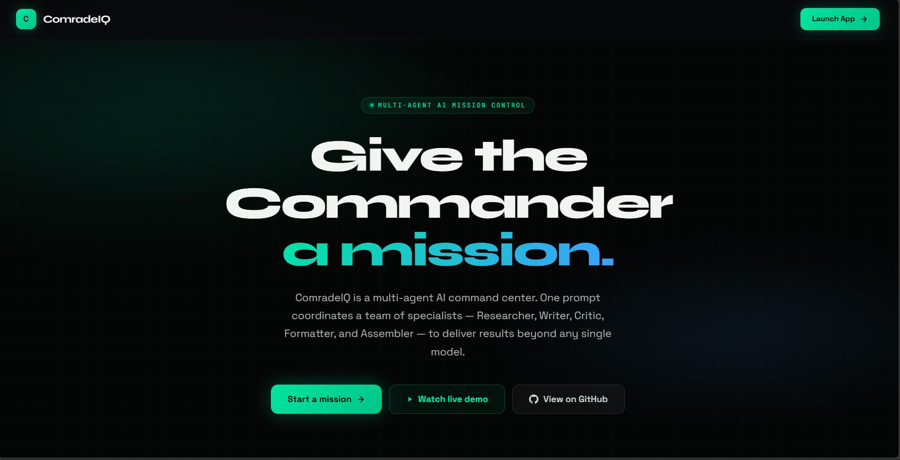

</div>

---

## Why ComradeIQ

Most "multi-agent" AI demos are theater: spinning cards that invent their own progress, phantom parallel calls, and confident answers with no traceable source. ComradeIQ takes the opposite stance. Every visible update traces to a real event, every artifact to real storage, and every error is an honest error. When a capability is not configured, the product says so plainly instead of faking it.

## The workspace

Watch the whole team work at once: a live **agent graph** lights up as the Commander delegates, a terminal-style **agent console** streams the real orchestration events, and the answer arrives with copy, share, and download actions.

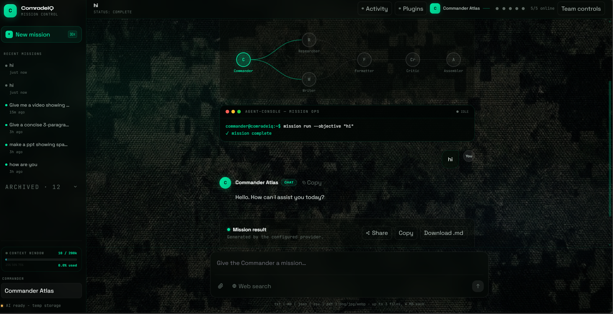

## What it does

Give one objective and ComradeIQ routes it to the right workflow automatically:

| Mode | You get |
| --- | --- |
| **Direct chat** | A fast, single answer with no unnecessary overhead |
| **Document** | A downloadable **Markdown** file (README, spec, report, docs) |
| **Presentation** | A downloadable **PPTX** deck in one of 4 themes (Camo, Cyberpunk, Minimal, Ocean) |
| **Research** | A **sourced, cited** answer with real links (opt-in web access) |

Every session starts from a calm command center with one-click example missions across all four modes:

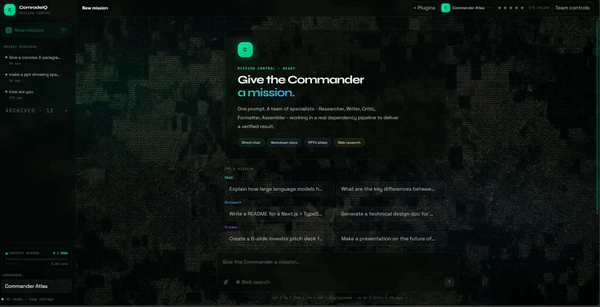

For work that needs coordination, the Commander builds and executes a real **dependency DAG**, where each specialist waits for its actual upstream output and sees only its own inputs (no shared transcript):

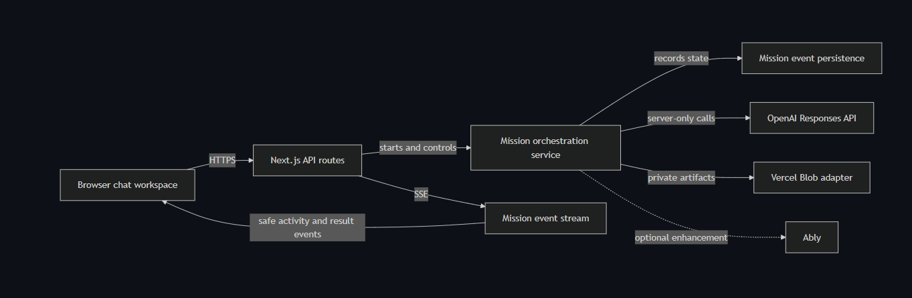

## Signature features

### Documents and decks you can download

Presentation missions run the full pipeline and generate a real, downloadable PPTX with a live in-app slide preview.

<table>
<tr>
<td width="55%">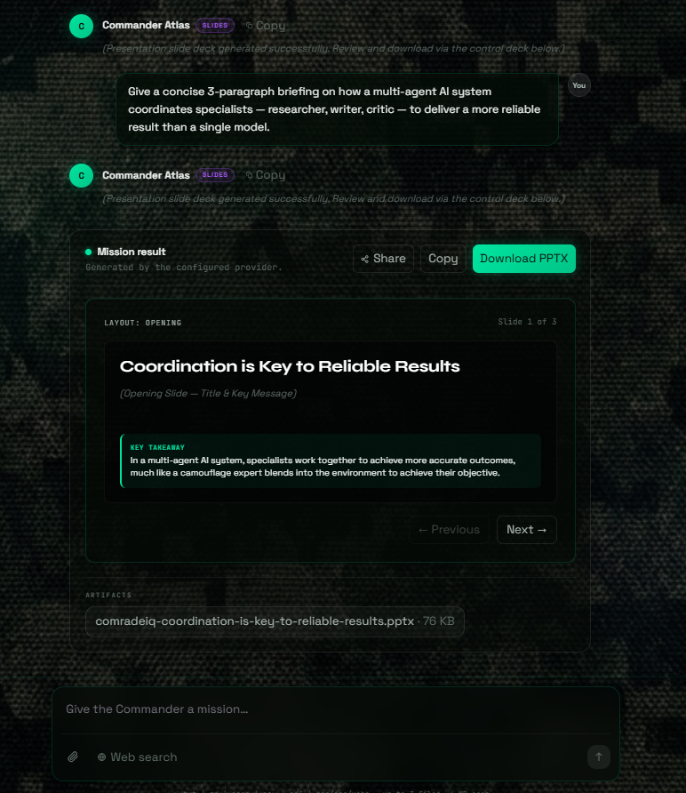</td>
<td width="45%">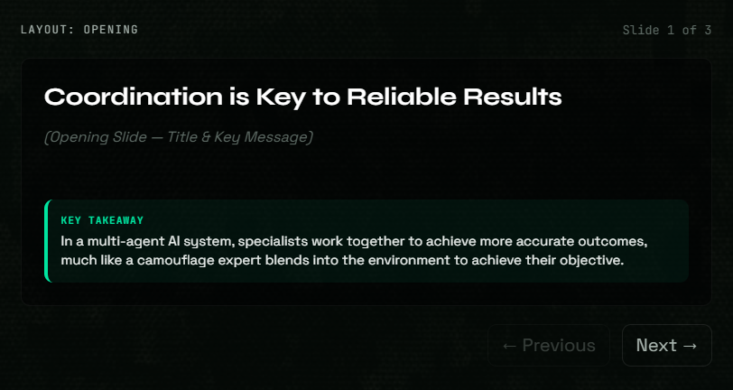</td>
</tr>
</table>

### Play chess with the Commander

Say "play chess with me" and a rules-validated board opens in chat. You play White; **Commander Atlas plays Black through the same model that runs missions.**

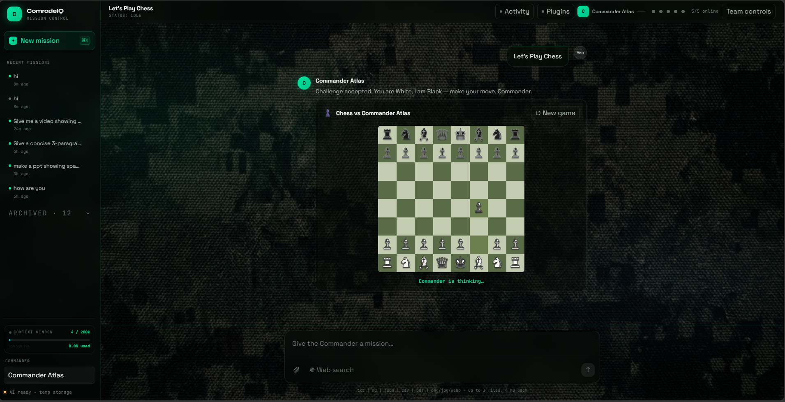

### In-chat video search and embed

Ask for a video and ComradeIQ searches YouTube and embeds a playable player right in the conversation.

<table>
<tr>
<td width="50%">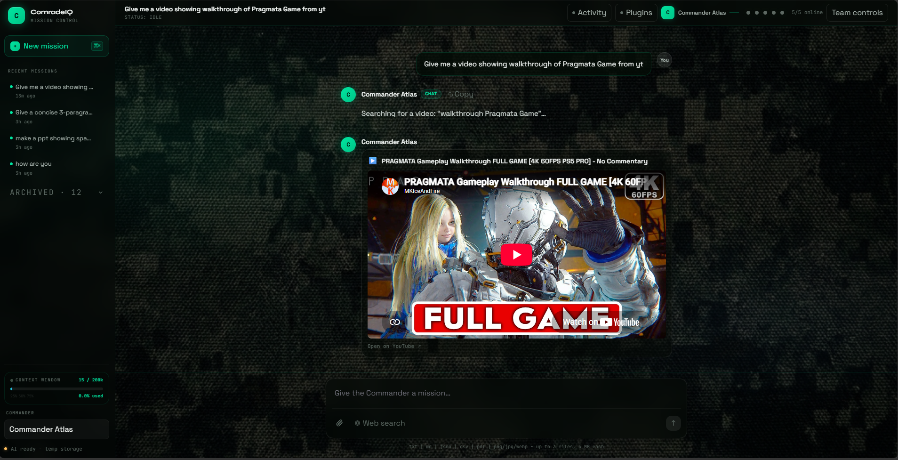</td>
<td width="50%">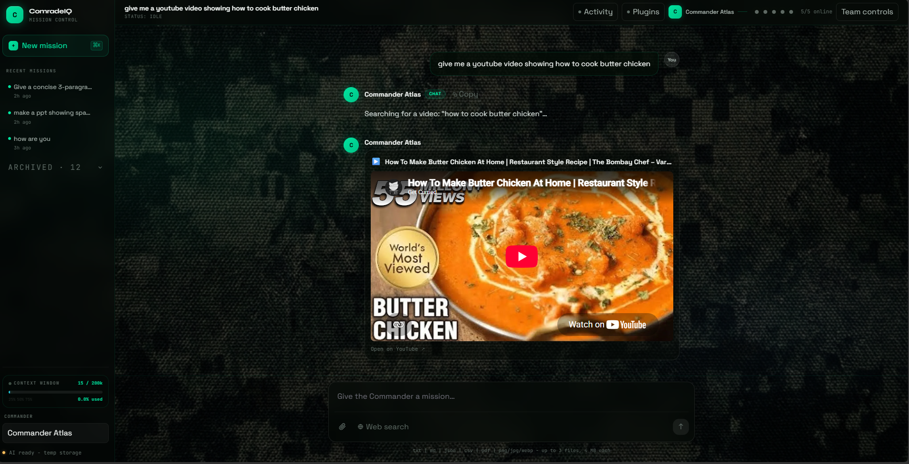</td>
</tr>
</table>

### Team controls and mission activity

The Commander connects directly to each specialist (never specialist-to-specialist), and every mission has a full, honest activity view.

<table>
<tr>
<td width="60%">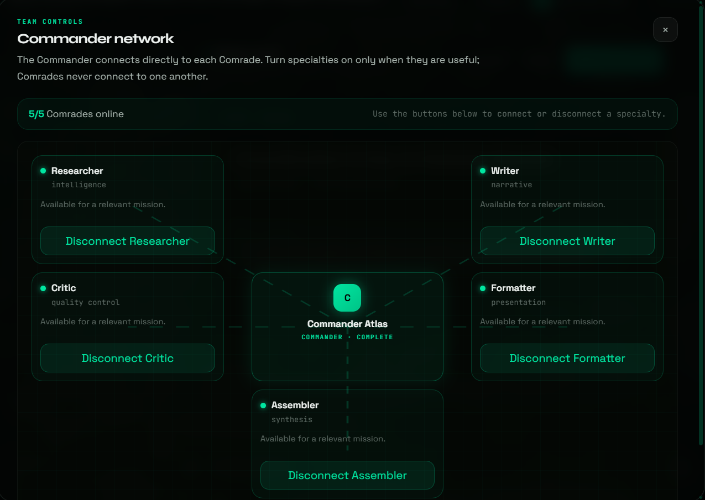</td>
<td width="40%">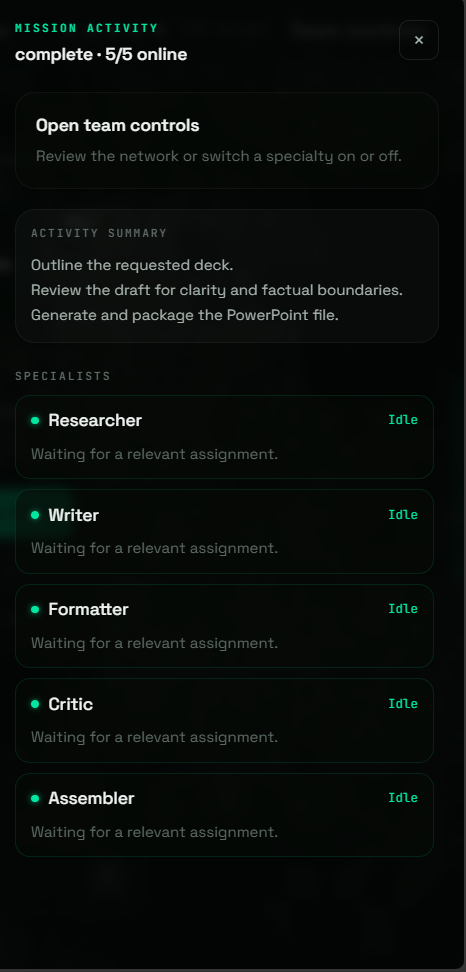</td>
</tr>
</table>

Finished missions also get a **shareable read-only `/m/<id>` permalink**, and every conversation has a hover menu to share, archive, or delete it.

## Tech stack

- **Next.js 15, React 19, TypeScript, Tailwind CSS** for a responsive, type-safe chat workspace
- **Any OpenAI-compatible provider** for server-only model calls; the live deployment runs **Groq `llama-3.3-70b`**
- **Server-Sent Events** for live progress, with optional Ably as a progressive enhancement
- **Vercel Blob** private storage for durable mission records and artifact bytes
- **PptxGenJS** for server-side decks, **chess.js** for a legality-validated board with an LLM opponent, and a keyless **YouTube search + embed** for in-chat video
- **Zustand** for client state, **Vitest + Playwright** for unit, DAG, state, accessibility, and reconnect coverage

## Routes

| Route | Purpose |
| --- | --- |
| `/` | Marketing landing page (shown first) |
| `/app` | The ComradeIQ mission-control tool |
| `/m/[missionId]` | Public, read-only shared mission result |

## Quick start

**Prerequisites:** Node.js 22.13+ and npm, plus an API key for any OpenAI-compatible provider (a Groq `gsk_...` key works out of the box).

```bash
git clone https://github.com/ShivankXD/ComradeIQ.git
cd ComradeIQ
npm ci
cp .env.example .env.local   # then add your key
npm run dev
```

Open [http://localhost:3000](http://localhost:3000). Without a key, ComradeIQ shows an honest setup state instead of faking a response.

### Minimal configuration

A single key is enough to run live. A `gsk_...` key is auto-detected and configured for Groq:

```env
OPENAI_API_KEY=gsk_your_key_here
```

Full options are documented in [`.env.example`](.env.example). Deployment guidance (including the Vercel Blob store that makes replies and downloads durable across serverless instances) is in [VERCEL_SETUP.md](VERCEL_SETUP.md).

## Project structure

```
app/            Landing page, /app tool, /m share page, API routes
components/     Chat workspace, agent graph, agent console, chess, video, panels
lib/            Orchestrator, DAG, provider client, intent routing, storage, store
docs/           Architecture, testing, screenshots, gallery
tests/          Vitest unit + Playwright e2e
```

## Verify and build

```bash
npm run lint
npm run test
npm run build
```

Browser coverage:

```bash
npx playwright install chromium
npm run test:e2e
```

## Privacy and security

- Provider, Ably, and Blob credentials are server-only and never exposed to the browser.
- An HTTP-only anonymous session cookie owns missions, events, retries, cancellation, and artifacts.
- State-changing requests require same-origin checks; artifact access is validated against mission ownership.
- The API applies input validation, MIME and size limits, rate and concurrency limits, timeouts, cancellation, and basic moderation.

## License

Released under the [MIT License](LICENSE).

<div align="center">
<sub>ComradeIQ · Built for DevPost Hackathon 2026</sub>
</div>
