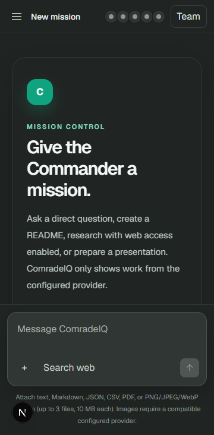
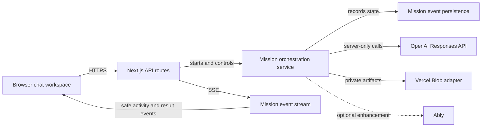

# ComradeIQ

> A conversation-first AI mission control that turns a request into a verified, downloadable result.

ComradeIQ is a premium, calm chat workspace for missions that need more than a single completion. It keeps the conversation as the primary surface and moves Commander/Comrade coordination into an optional Team Controls view. There are no simulated answers, placeholder research, or pretend artifacts: when a capability is not configured, the product says so clearly.




## The problem

AI workspaces often make collaboration look impressive without making the output dependable. A wall of agent activity can obscure the answer, disguise invented progress, and leave users unsure which files, sources, or results are real.

## The solution

ComradeIQ routes each mission through a capability-aware workflow:

- Casual conversation gets a fast, direct server-side OpenAI response.
- README, Markdown, code, and document work uses an artifact workflow that can create a downloadable Markdown file.
- Presentation requests use a structured deck workflow that generates a downloadable PPTX.
- Web research is strictly opt-in and returns source links and provenance.
- Work that benefits from specialists runs through a genuine dependency DAG: Commander plan → Researcher + Writer (when relevant) → Formatter + Critic with upstream output → Assembler → Commander QA.

Progress is streamed with SSE by default and stored with each mission. Ably can enhance a configured deployment, but it is never required for progress to appear.

## Product principles

- **Truthful by default.** No key means no invented answer. Missing object storage means no claim of deployment-safe downloads.
- **Chat first.** The team visualization is compact in the workspace and full controls are opt-in.
- **Safe operations.** Keys stay server-side; requests, files, artifact access, retries, and optional realtime tokens are owner-scoped.
- **Useful coordination.** Only needed Comrades activate. The Commander connects to Comrades, never Comrade-to-Comrade links.
- **Accessible controls.** Dialogs manage focus and close with Escape; status updates are announced; maps have keyboard alternatives.

## Architecture

The browser only receives owner-scoped mission and artifact URLs. Provider credentials, storage credentials, validation, moderation, orchestration, and durable event persistence remain on the server.



See [the detailed architecture](docs/architecture.md) and the [editable FigJam diagram](https://www.figma.com/board/7lwbfDvH9frZmpRESkTa6X?utm_source=other&utm_content=edit_in_figjam&oai_id=v1%2Fp5HYVp1JRBa4T7KD9ulK7OBhsccSgYdyMQsoGuF1PcIiWFIp1NKKPt&request_id=a3388193-4a39-4250-b6fa-a25772c03ee9&architecture=true).

## Stack

- Next.js 15, React 19, TypeScript, Tailwind CSS, Zustand, and Framer Motion
- OpenAI Responses API with a configurable [`gpt-5.6-terra`](https://developers.openai.com/api/docs/models/gpt-5.6-terra) default model
- Server-Sent Events, with optional Ably subscriptions
- Vercel Blob private storage adapter for durable mission records and artifact bytes
- PptxGenJS for deck generation; PDF extraction for supported uploads
- Vitest, Playwright, ESLint, and GitHub Actions

## Quick start

### Prerequisites

- Node.js **22.13+** and npm
- An OpenAI API key for live AI behavior
- A private Vercel Blob store for deployment-safe mission persistence and downloads

```powershell
git clone https://github.com/ShivankXD/ComradeIQ.git
cd ComradeIQ/comradeiq
npm ci
Copy-Item .env.example .env.local
npm run dev
```

Open [http://localhost:3000](http://localhost:3000). Without `OPENAI_API_KEY`, ComradeIQ displays an honest setup state. It does not emulate a provider response.

## Environment variables

Copy `.env.example` to `.env.local`. Do not commit `.env.local` or any credential.

| Variable | Required | Purpose |
| --- | --- | --- |
| `OPENAI_API_KEY` | For live AI | Read only on the server; enables model calls and moderation. |
| `OPENAI_MODEL` | No | Main Responses API model. Defaults to `gpt-5.6-terra`. |
| `OPENAI_VISION_MODEL` | No | Explicit vision-capable model used for supported image input. |
| `BLOB_READ_WRITE_TOKEN` | Production | Credentials for a **private** Vercel Blob store. Enables durable mission/event/artifact persistence. |
| `ABLY_API_KEY` | No | Optional best-effort realtime enhancement. SSE remains the default. |
| `COMRADEIQ_MISSION_TIMEOUT_SECONDS` | No | Per-mission timeout, 10–300 seconds (default 55). |
| `COMRADEIQ_MAX_CONCURRENT_MISSIONS` | No | Instance-wide mission concurrency, 1–20 (default 3). |
| `COMRADEIQ_MAX_MISSIONS_PER_MINUTE` | No | Per-session start rate, 1–60 (default 6). |
| `COMRADEIQ_MAX_ATTACHMENTS` | No | Upload count limit, 0–5 (default 3). |
| `COMRADEIQ_MAX_ATTACHMENT_BYTES` | No | Per-attachment limit, 64 KiB–8 MiB (default 4 MiB). |
| `COMRADEIQ_DISABLE_MODERATION` | No | Set `true` only when an approved deployment policy requires moderation to be disabled. |

`VERCEL_OIDC_TOKEN` and `BLOB_STORE_ID` are also supported when Vercel provides workload identity for the private Blob store.

## Deployment

1. Create a private Vercel Blob store and connect it to the deployment.
2. Add the environment variables above in the deployment provider’s server environment; never prefix secrets with `NEXT_PUBLIC_`.
3. Deploy with Node 22.13+.
4. Visit `/api/health/ai` to verify the safe configuration summary. It reveals provider and capability status, never keys.
5. Exercise the demo flow below and verify a downloaded PPTX opens after a fresh deployment instance.

If private Blob storage is absent, ComradeIQ remains useful for local development with instance-memory state, but declares that state and artifacts are non-durable. It does not claim production-ready artifact storage.

## Supported inputs and outputs

| Capability | Supported behavior |
| --- | --- |
| Text, Markdown, JSON, CSV | Server-side validation and bounded text extraction |
| PDF | Server-side text extraction when readable |
| Images | Sent as image input only when a vision-capable model is configured |
| Audio / video / unknown media | Explicitly labelled unsupported; never claimed as analyzed |
| Web research | Only when the user turns it on; source links and provenance are returned |
| Markdown | Safely rendered GFM-style headings, lists, links, code blocks, tables, citations, copy action, and Markdown download |
| PPTX | Structured deck generation and owner-scoped download URL; durable with private Blob storage |

## Privacy and security

- OpenAI, Ably, and Blob credentials are server-only.
- An HTTP-only anonymous session cookie owns missions, events, retries, cancellation, artifacts, and short-lived Ably subscriptions.
- State-changing browser requests require same-origin checks.
- The API applies input validation, MIME/size limits, request limits, concurrency controls, timeouts, cancellation, error classification, and basic moderation.
- Display-safe mission activity never exposes hidden model reasoning or raw provider errors.
- Artifact retrieval is checked against mission ownership instead of trusting a guessed file name.

## Verification

```powershell
npm run lint
npm run test
npm run build
npm audit --omit=dev
```

For browser coverage:

```powershell
npx playwright install chromium
npm run test:e2e
```

The default browser suite verifies no-key onboarding, disconnect/reconnect, and mobile layout. Real greeting, README, web-research, presentation, and download checks are opt-in because they use a real server-side provider key and can incur cost:

```powershell
$env:COMRADEIQ_E2E_LIVE = "1"
$env:OPENAI_API_KEY = "your-server-side-key"
npm run test:e2e
```

See [testing details](docs/testing.md).

## Demo flow

1. Start without a key to demonstrate the truthful provider setup state.
2. Configure a server-side `OPENAI_API_KEY`, ask `hi`, and show the direct response.
3. Attach a Markdown file and request a README; show progress, rendered output, and **Download .md**.
4. Enable internet research and show sourced links.
5. Request a short presentation, download the PPTX, and open it.
6. Open Team Controls, disconnect/reconnect a Comrade from the keyboard, close with Escape, and show the mobile layout.

The timed narration is in [DEMO_SCRIPT.md](DEMO_SCRIPT.md); Devpost-ready copy is in [DEVPOST.md](DEVPOST.md).

## Limitations

- An anonymous session is a practical single-browser ownership boundary, not a collaborative account system.
- In-memory persistence is intentionally development-only and is lost on restart or across instances.
- Retry and cancellation use attempt fencing to prevent stale completions from being surfaced, but rate and concurrency limits are currently instance-local. High-volume multi-instance deployments should add a shared queue or distributed lease.
- Image analysis depends on a configured vision-capable model. Audio and video are unsupported.
- Real model output can be imperfect; ComradeIQ reports operational errors and sources, but users remain responsible for reviewing consequential artifacts.

## License

Released under the [MIT License](LICENSE).
