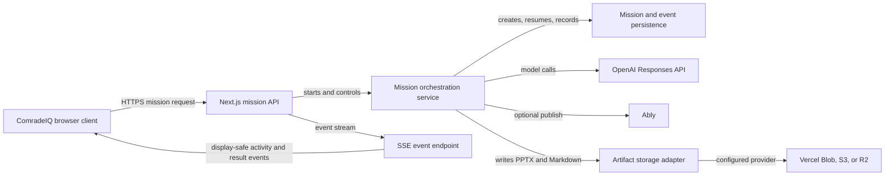

# ComradeIQ architecture

ComradeIQ keeps credentials and provider calls on the server. The browser owns only an anonymous session token, mission IDs issued for that session, and presentation/download links that the server authorizes. Server-Sent Events are the primary live transport; Ably is strictly optional.

## Trust boundaries

- The browser does not receive OpenAI, Ably, or object-storage credentials.
- A server-issued anonymous session owns each mission. Reads, retries, cancellation, event streams, artifacts, and optional realtime tokens are scoped to that owner.
- The event stream contains concise progress and result information only; it does not expose private reasoning.
- If a provider is not configured, the health endpoint and UI expose an explicit configuration state instead of simulating the capability.

## Mission flow

1. The API validates the request, size, file types, rate limit, and session ownership.
2. The router selects a direct, artifact, presentation, or opt-in web-research path from structured intent and capability checks.
3. The Commander builds the required DAG and activates only the necessary Comrades.
4. The service records each safe mission event, fans it out via SSE, and optionally publishes it through Ably.
5. Reviewed output is assembled, QA'd by the Commander, persisted, and returned as safely rendered Markdown or a durable artifact download.

An editable version of this architecture is available in [FigJam](https://www.figma.com/board/7lwbfDvH9frZmpRESkTa6X?utm_source=other&utm_content=edit_in_figjam&oai_id=v1%2Fp5HYVp1JRBa4T7KD9ulK7OBhsccSgYdyMQsoGuF1PcIiWFIp1NKKPt&request_id=a3388193-4a39-4250-b6fa-a25772c03ee9&architecture=true).
